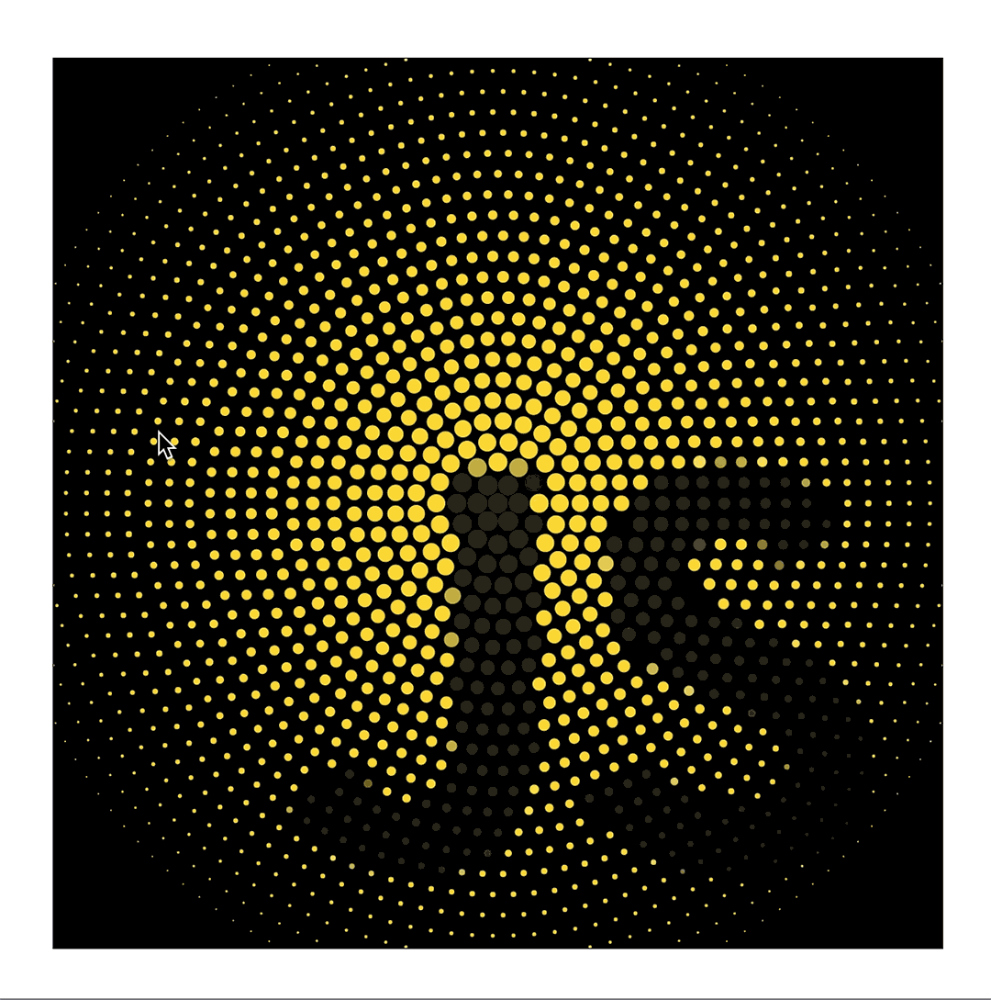

<h1 align="center">Particles Animation on Mousemove</h1>

This is the particles animation on the mousemove event, written into the JavaScript. The code uses the HTML canvas element to draw the particles on it and swipes theirs pixels with the pixels of the reference image.

For better demonstration please visit to the following link:

- Note: the animation interacts only with the mouse.
-  [Demo.](https://aleksandre19.github.io/abstract_animation/)

<h2 align="center"></h2>